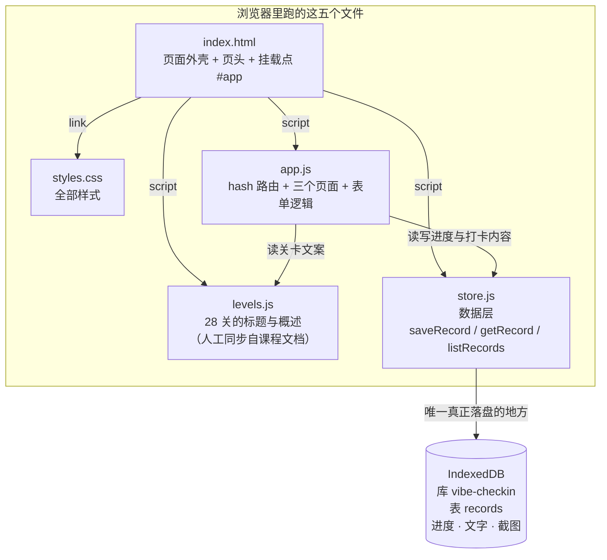

# 运行说明｜28 天 Vibe Coding 打卡闯关站

> Day 7 产出｜对应完成标准「运行命令已存档」

## 一、这是什么

把 28 天的 Vibe Coding 打卡做成闯关样式的网页：每天完成打卡即通过一关，28 天对应 28 关。

纯前端，**没有后端、没有数据库、不需要登录**。打卡内容与进度只存在你自己这台设备的浏览器里，不上传任何服务器。

## 二、怎么运行

### 第 1 步：打开终端，进到项目目录

```bash
cd "C:/Users/lenovo/WorkBuddy/Worktrees/Vibe-Coding-打卡/main-ada0335d"
```

### 第 2 步：起一个本地静态服务器

```bash
python -m http.server 8000
```

> **这条命令在干什么**：把当前文件夹当成一个网站，发布到本机的 8000 端口。
> `python` 是 Python 的解释器，`-m http.server` 是它自带的一个简易网页服务器模块。
> 看到 `Serving HTTP on 127.0.0.1 port 8000 ...` 就是起来了。
> **这个窗口不要关**，关掉服务就停了。

如果提示端口被占用，换个端口号即可（比如 `python -m http.server 8080`），浏览器地址里的端口号要跟着改。

### 第 3 步：浏览器打开

```
http://localhost:8000
```

## 三、为什么不能直接双击 index.html

双击打开走的是 `file://` 协议。**部分浏览器会禁用 `file://` 下的本地存储（IndexedDB）**，
页面会显示「读不到本机进度」。

所以**必须用上面的本地服务器方式打开**，地址栏是 `http://localhost:8000` 才算对。

## 四、跑起来之后应该看到什么

- 一个标题为「闯关地图」的页面，下面按 4 周分组，一共 **28 个关卡格子**
- 全新设备上：**第 1 关是蓝框（可打卡）**，第 2–28 关是灰的（未解锁）
- 进度条显示 `0 / 28 关已完成`
- 点第 1 关 → 能看到标题和任务概述 → 点「开始打卡」→ 进打卡页

三种颜色的含义：

| 样子 | 含义 |
|---|---|
| 绿色 · 已完成 | 已经打过卡了，可以点进去回看当时留下的内容 |
| 蓝色 · 可打卡 | 当前唯一可以打卡的那一关 |
| 灰色 · 未解锁 | 还没轮到，能进去看标题，但「开始打卡」点不动 |

## 五、三个页面地址

用的是带 `#` 的地址，所以**直接改地址栏打开某一关不会 404**：

| 地址 | 页面 | 能做什么 |
|---|---|---|
| `http://localhost:8000/#/levels` | 关卡列表 | 只读，看整体进度 |
| `http://localhost:8000/#/level/5` | 关卡详情 | 看标题与概述；已完成的关在这里回看 |
| `http://localhost:8000/#/level/5/checkin` | 打卡页 | **全站唯一的写入入口** |

把地址里的 `5` 换成 1–28 任意数字即可。换到没解锁的关，页面能看，但按钮点不动。

## 六、数据存在哪

| 项 | 值 |
|---|---|
| 存放位置 | 浏览器的 IndexedDB |
| 库名 | `vibe-checkin` |
| 表名 | `records` |
| 主键 | `levelId`（关卡号 1–28） |

一条记录长这样：

```js
{
  levelId: 1,                    // 哪一关
  completedAt: 1758364800000,    // 完成时间（毫秒时间戳）
  text: '今天做了什么…',          // 文字记录
  shot: Blob                     // 截图（已压成 JPEG，长边 1280）
}
```

**怎么看它**：按 F12 打开开发者工具 → `Application`（应用）→ 左侧 `IndexedDB` → `vibe-checkin` → `records`。

## 七、怎么清空重来

F12 → `Application` → `IndexedDB` → 右键 `vibe-checkin` → `Delete database` → 刷新页面。

（换了设备、换了浏览器、清了浏览器数据，记录都会没有——这是「不需要登录」的代价，见 PRD 风险 R1 / R3。）

## 八、项目文件结构



### 每个文件负责什么

| 文件 | 属于哪天 | 职责 |
|---|---|---|
| `index.html` | Day 2 建立 / Day 7 重写 | 页面外壳，按顺序加载另外四个文件 |
| `styles.css` | Day 7 | 全部样式 |
| `levels.js` | Day 7 | 28 关的标题与任务概述。**改文案只改这一个文件** |
| `store.js` | Day 7 | 数据层。对外只暴露三个动作，换存储方式只动这里 |
| `app.js` | Day 7 | 路由、三个页面的渲染、打卡表单与校验 |

**关键设计**：`app.js` 从不直接碰 IndexedDB，只调用 `store.js` 的三个动作。
这样以后要换成后端数据库，改动被限制在 `store.js` 一个文件里（见 `TECH_DESIGN.md` 第三章）。

## 九、常见问题

| 现象 | 原因 | 怎么办 |
|---|---|---|
| 页面显示「读不到本机进度」 | 用了 `file://` 双击打开，或开了无痕/隐私窗口 | 改用 `python -m http.server` 起服务，用 `localhost` 打开 |
| 浏览器提示「无法访问此网站」 | 服务器窗口被关了，或端口号不对 | 重新执行第 2 步；确认地址里的端口号和命令里一致 |
| 提示端口已被占用 | 8000 被别的程序占了 | 换个端口，如 `python -m http.server 8080` |
| 刷新后填的内容没了 | 这是设计如此（PRD F8） | 要点「完成打卡」才会保存；填一半刷新本来就不保留 |
| 已完成的关不能改了 | 过了完成当天（北京时间）24:00 | 设计如此（PRD F7）。完成当天内可以改 |
| 换电脑看不到之前的记录 | 数据只在这台设备的这个浏览器里 | 设计如此，本期不做云同步（PRD 后续清单 N2） |

## 十、本次 MVP 的边界（本期不做）

登录注册、排行榜、组队 PK、装备金币、云同步、把截图传到云存储——都不在本期范围内，
理由见 `PRD.md` 第二章「非目标」。

---

**改代码后不用重新构建**：这是原生 HTML/CSS/JS，没有打包步骤，**改完保存、刷新浏览器就见效**。
