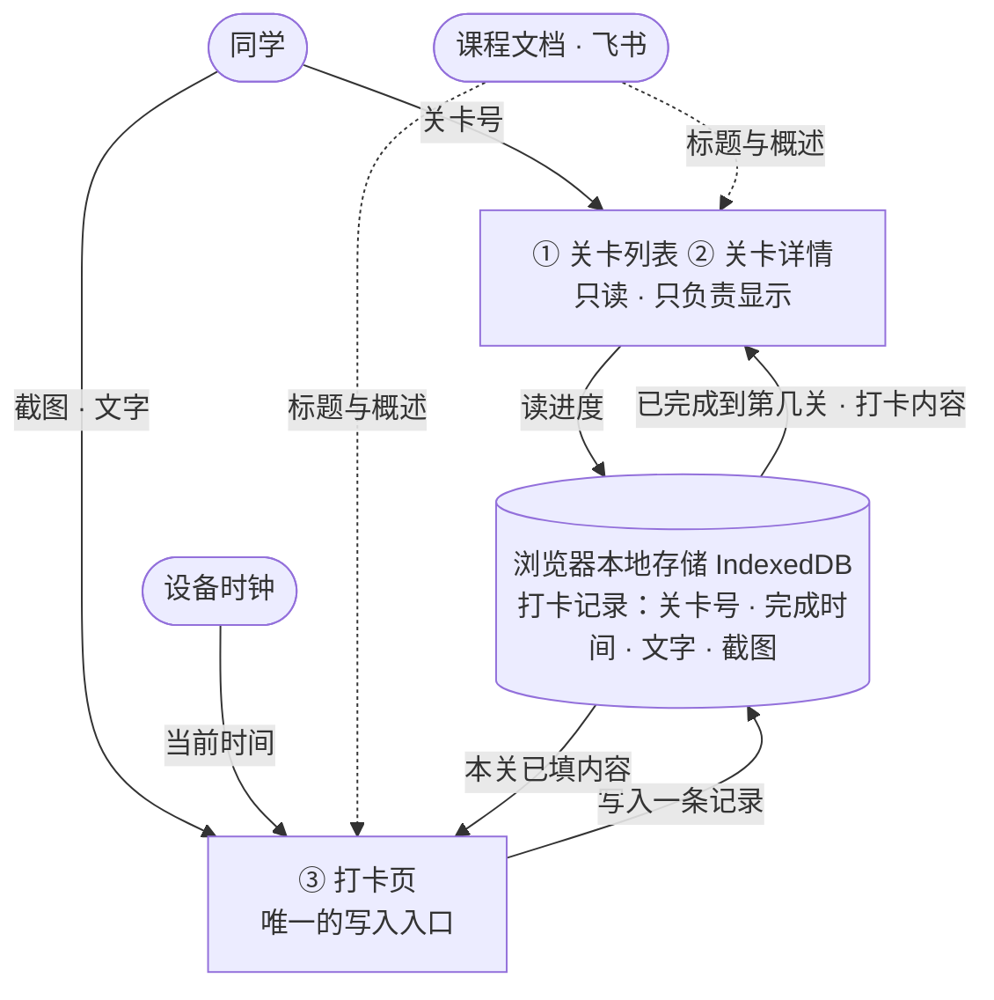

# 技术设计｜28 天 Vibe Coding 打卡闯关站

> Day 5 产出｜输入来源：`PRD.md`｜下一步：Day 6 保存项目规则

## 一、一句话技术路线

**一个不引框架的静态网页（原生 HTML + CSS + JavaScript），三个页面用带 `#` 的地址区分，全部打卡数据（进度、文字、截图）存在浏览器的大抽屉（IndexedDB）里，发布到国内静态托管上。**

## 二、前后端与数据库的分工

### 三层各干什么

| 层 | 干什么 | 类比 |
|---|---|---|
| **前端** | 把数据画给用户看；收集用户的输入 | 店面 · 菜单 · 服务员 —— 你看得见、能开口的地方 |
| **后端** | 检查、加工数据；判断谁可以做什么 | 后厨 · 店规 —— 你看不见，但它说了算 |
| **数据库** | 把数据长期存住，明天打开还在 | 仓库 · 账本 |

判断某条需求属于哪一层，只问一个问题：**它需不需要「记住别人的事」？**

- **需要** → 必须有后端 + 数据库（「别人的事」要放在双方都能访问的地方，还要有个中立的角色来管）
- **不需要，只关乎自己这台设备** → 前端自己就能搞定

### 本项目的结论：只有前端

| 层 | 有吗 | 为什么 |
|---|---|---|
| 前端 | **有** | 用户看得见的那部分，必须做 |
| 后端 | **没有** | 没有账号系统，就不需要有人在中间替用户判断 |
| 数据库 | **没有** | 数据只属于用户这台设备 → 改用浏览器自带的存储 |

**PRD 功能逐条归层**（F1–F8，见 `PRD.md` 第四章）：

| PRD 条款 | 属于哪层 |
|---|---|
| F1 关卡列表 | 前端 |
| F2 关卡详情 | 前端 |
| F3 打卡页 | 前端 |
| F4 完成打卡 | 前端（规矩在本机判断） |
| F5 进度保存 | 前端 + 浏览器存储 |
| F6 回看 | 前端 + 浏览器存储 |
| F7 当天可改、跨天只读 | 前端（读设备时间判断） |
| F8 填一半刷新不保留 | 前端（不写存储就等于不保留） |

### 一个反直觉的点

「没有后端」不是「功能少了一块」，而是**判断权从「别人替我管」变成了「我自己管」**。

例：PRD 第六章的核心规则「任何时刻只有编号最小的未完成关卡可以打卡」—— 有后端时由后端判断你该打哪一关；本项目没有后端，**由前端自己判断**。

区别一句话：**前端的判断只有你自己认，后端的判断所有人都认。**

注意：浏览器里的存储**不等于数据库** —— 它只服务这一台设备、只有你能打开，别人永远看不到。

### 代价（四条，如实记下）

1. 换电脑、换浏览器 → 之前的记录看不到（`PRD.md` R3）
2. 100 位同学各看各的，看不到别人（已在 PRD 中砍掉，记入后续清单 N3）
3. 挡不住作弊：改设备时间、直接改本机数据（`PRD.md` R6）
4. 没有备份，清浏览器数据记录就没了（`PRD.md` R1）

这四条不是「暂时忍一下」的技术缺陷，**是产品定位的直接后果**：这个产品不需要账号，打卡是对自己负责，不需要一个中央裁判。

## 三、技术选型表

| # | 位置 | 选择 | 为什么 | 代价 |
|---|---|---|---|---|
| ① | 界面用什么写 | **原生 HTML / CSS / JavaScript，不引框架** | 3 个页面、28 个格子、一份进度记录，状态少到不需要框架；改完刷新就见效；部署不需要打包 | 页面切换与界面同步要自己写；以后功能变多（每关不同要求、导入导出）会比框架累 |
| ② | 打卡数据存哪 | **全部存 IndexedDB（大抽屉）** | 对应 PRD 的 R4。上限几百 MB，且能**原样存图片不膨胀**；28 张截图约 3.4–7.5MB，只有它还放得下 | 读写是异步的，需要封一层小模块；调试要去浏览器的 Application 面板里看 |
| ③ | 三个页面的地址 | **带 `#` 的形式**（`#/level/5`） | 对应 PRD 第五章异常路径 3 与验收 13。不依赖服务端配置，任何静态托管都能用，改地址直接打开某一关**不会 404** | 地址里多一个 `#`，不够好看 |
| ④ | 代码怎么变成网页 | **不需要构建，源码即上线文件** | 跟着 ① 走 —— 不引框架，就没有「打包」这一步 | 无。这是 ① 的连带好处 |
| ⑤ | 网页放在哪 | **静态托管** | PRD 第一章要求「部署在网上、需要联网打开」。100 位同学都在国内，访问速度优先 | 要在托管平台建一个项目；以后绑自定义域名可能涉及备案 |
| ⑥ | 时间怎么校验 | **只读设备上的时间，不假装能防篡改** | 对应 PRD 的 R6。纯前端没有中立的时间源，强制校验做不到 | 改设备时间可以绕过「跨天不能改」—— 如实记录，不隐藏 |

### 一条配套的设计约定

**把「存 / 取数据」收口到一个小模块。** 对外只暴露三个动作 —— 保存记录、读取记录、列出全部；内部用哪个抽屉是模块的实现细节。

这样做的意义：**第 ② 项这个选择只影响一个文件**，以后要换，改动面被限制住。

### 为什么不用 localStorage（小抽屉）

浏览器给每个网站两个数据抽屉：

| | localStorage（小抽屉） | IndexedDB（大抽屉） |
|---|---|---|
| 单站上限 | 约 5MB | 通常几百 MB |
| 能存什么 | **只能存文本** —— 图片必须先转成 base64，体积**再涨约 1/3** | 图片文件**原样存**，不膨胀 |

账目（估算）：截图压缩到长边 1280px、JPEG 质量 0.7，单张约 120–200KB；转 base64 后约 160–270KB；**28 张 ≈ 4.5–7.5MB**。

结论：小抽屉要么**正好顶满 5MB 上限、一点余量不留**，要么**直接存不下**；而且爆掉的那天出现在**第 20 多天** —— 那时用户已经打卡 20 多天，损失最大。**容量必须按「一位同学连续打卡 28 天」来定，不能按开发者自测时的上传数量来定。**

## 四、数据流图

虚线表示**人工同步**（本期关卡标题与概述由人工从课程文档抄进页面，不自动更新，对应 `PRD.md` R5）。

### 每条箭头读成一句话

| # | 箭头 | 读成一句话 |
|---|---|---|
| 1 | 同学 → 关卡列表 / 详情 | 同学「点第 5 关」或改地址，等于告诉页面一个**关卡号** |
| 2 | 同学 → 打卡页 | 同学**上传的截图、写的文字**进到打卡页 |
| 3 | 设备时钟 → 打卡页 | 打卡页取**当前时间**，用来判断「今天」和「能不能改」 |
| 4 | 课程文档 → 关卡列表 / 详情 | 28 关的**标题与概述**来自课程文档（人工抄入） |
| 5 | 课程文档 → 打卡页 | 同上，打卡页也要显示本关概述 |
| 6 | 关卡列表 / 详情 → 存储 | 页面**去存储里读**：我打到第几关了？ |
| 7 | 存储 → 关卡列表 / 详情 | 存储**把结果递回来**：已完成到第 N 关，以及各关留下的截图与文字 |
| 8 | 打卡页 → 存储 | 点「完成打卡」，**写入一条记录** |
| 9 | 存储 → 打卡页 | 打开已完成的关，**从存储里读出**当时填的内容（完成当天才允许改） |

### 一句话总答案

**数据只有两个源头 —— 你的手（点选、截图、文字）和这台设备的时钟；数据只有一个去处 —— 浏览器里那个大抽屉。全程不经过任何服务器。**

### 故意没画进图里的一条

打卡页上「跳转课程文档」按钮 —— 点它会离开网站去看完整任务。这是**「跳出去」的操作，不是数据流**，按判据不画入本图（对应 PRD 的 F3、验收第 5 条）。

## 五、回答 PRD 留的 3 个接口

### 1. 三页面对应的地址形式（PRD 第五章异常路径 3 · 验收第 13 条）

- 地址形式：带 `#` 的 hash 形式。三页分别形如 `#/levels`、`#/level/5`、`#/level/5/checkin`。
- 改地址直接打开第 5 关时的行为：页面照常渲染第 5 关的**标题与概述**；「开始打卡」按钮**是否可点**，由「本机存储里编号最小的未完成关卡是不是 5」决定 —— 不是，就置灰点不了。
- 为什么不用不带 `#` 的路径形式：直接输入 `/level/5` 时服务器会去找一个叫 `level/5` 的文件，找不到就返回 404；要支持它必须依赖托管服务的重写配置，本地双击打开也会失效。

### 2. 截图存哪、容量够不够（PRD R4）

- 存放位置：与文字、进度**同一个库**（IndexedDB）。单一数据源，读写、清空、以后做导出都只有一套规则。
- 上传时先压缩再存：长边 1280px、JPEG 质量 0.7 → 单张约 120–200KB。
- 容量测算：28 张 ≈ 3.4–5.6MB，**远低于 IndexedDB 的容量上限**。
- 附带说明：小抽屉（localStorage）上限约 5MB 且只能存文本（图片转 base64 再涨约 1/3），**已排除**，理由见第三章。

### 3. 「北京时间」怎么校验（PRD R6）

- 做法：完成打卡时，把**当时的设备时间**写进这条记录；判断「是否完成当天」时，用设备当前时间与该记录时间比较（以北京时间为准的日期）。
- **诚实结论**：纯前端没有中立的第三方时间源，**改设备时间可以绕过这个限制，无法防止**。
- 处理方式：不假装能防住 —— 该限制写入第六章风险，并在产品预期里接受它。

### 4. 顺带一条：填一半刷新为什么不保留（PRD F8）

输入过程中**不写存储**，只有点「完成打卡」才写入一条记录。所以刷新页面必然清空 —— 这不是遗漏，是设计。

## 六、技术风险与不做

| # | 风险 | 说明 |
|---|---|---|
| T1 | 数据只在本机 | 换设备、换浏览器、清浏览器数据 → 记录丢失（PRD R1 / R3）。选 IndexedDB 只解决容量，不解决备份 |
| T2 | 浏览器可能清理本站数据 | 磁盘紧张时浏览器有权清理；可通过 Storage API 申请「持久化」存储，但**浏览器不保证批准**。这条是纯前端的固有风险，登记备查 |
| T3 | 关卡标题与概述靠人工同步 | 课程文档改了，网站不会自动跟着变（PRD R5） |
| T4 | 时间可被绕过 | 见第五章第 3 条（PRD R6） |
| T5 | 界面同步靠手写 | 用了原生方案，页面切换与界面更新需要人工保证一致（第三章 ① 的代价） |

**本期不做**：后端、数据库、云备份、账号系统、框架与构建工具链、把截图上传到云存储桶（均对应 `PRD.md` 第九章后续清单）。

## 七、什么情况下该换掉今天的选择

技术路线是有保质期的。今天的选择只代表「现在最合适」。以下是每一条的**换掉条件**与**换的时候要动什么**：

| 位置 | 什么情况该换 | 换的时候要动什么 |
|---|---|---|
| ① 不引框架 | 页面数量明显增加（如 10 个以上）、或出现大量需要局部实时更新的界面 | 界面代码整体重写；**只要数据结构不变，已打卡数据不用动** |
| ② 全部存 IndexedDB | 出现「换设备也要能看到」的需求 | 不是换抽屉能解决的 —— 必须上后端与数据库 |
| ③ 带 `#` 的地址 | 想要干净网址，且换到可配置重写规则的托管 | 所有「生成链接、页面跳转」的代码；旧地址失效 |
| ④ 无需构建 | 引入框架、或需要使用只有构建工具才能处理的写法 | 增加打包步骤，部署流程随之改变 |
| ⑤ 静态托管 | 需要服务端能力（如给上传签临时密钥） | 部署方式改变，可能同时改变 ① 与 ④ |
| ⑥ 只读设备时间 | 上了后端，可以用服务器时间做中立判断 | 打卡与改期的判断逻辑改到服务端 |

**判据一句话**：**当需求开始需要「记住别人的事」，② 号选择就必须换，其余几条会跟着连动。**

## 八、以后什么时候需要上后端

- **触发条件**：出现任何「需要记住别人的事」的需求 —— 账号系统、跨设备同步、看别人的进度、云备份、把截图传到云存储。
- **时间点**：按课程安排在第 23 天讲数据库之后。对应 `PRD.md` 后续清单的 **N1（截图入云存储桶）· N2（账号 + 跨设备）· N3（看别人进度）**。
- **那时今天定的什么要改**：② 从浏览器存储换成数据库；③ 地址形式可能随之改变；⑤ 部署方式要加服务端能力；⑥ 时间判断可以挪到服务端。
- **什么不用改**：产品规则（PRD 第六、七章的 17 条验收标准）与数据结构（一条打卡记录包含什么）—— 这正是今天把这两样设计得比界面代码更慎重的原因。
